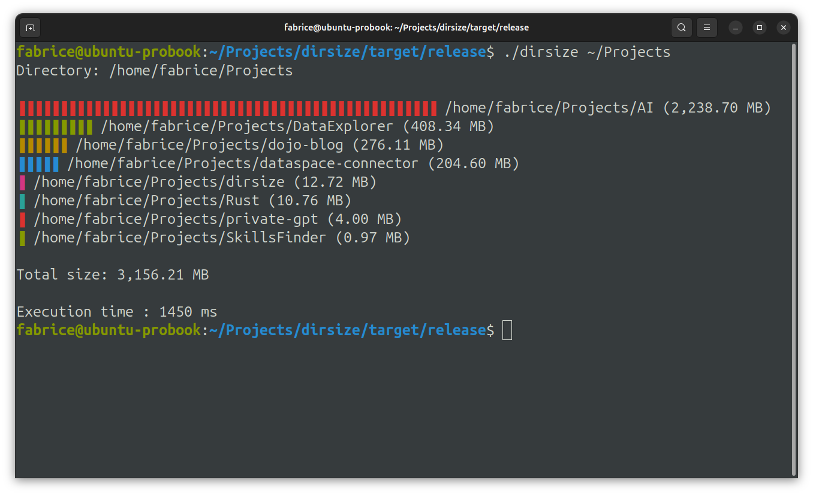

# dirsize

A simple Rust program to display the size of all subdirectories in a given directory (recursively), sorted from largest to smallest, with a colored bar graph in the terminal.

## Usage
Using the source code:

```
cargo run -- [directory_path]
```
Using the executable:
```
./dirsize [directory_path]
```

- If `[directory_path]` is omitted, the current directory is used.
- The output shows each subdirectory, its size in MB (with thousands separator), and a colored bar proportional to its size.
- The total size of all subdirectories is displayed at the end.



## Example

```
cargo run -- /home/user/Documents
```

## Requirements
- Rust toolchain (https://rustup.rs)

